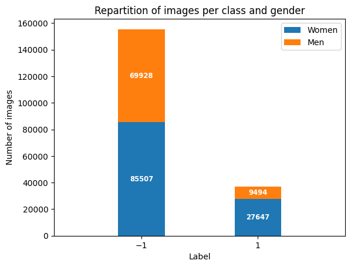
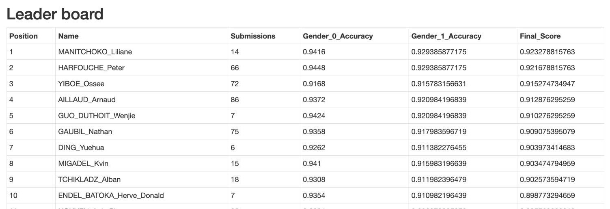

# Face Classification based on Unknown Criteria

This repository comprises my solution to a datachallenge organised at Telecom Paris in partnership with Idemia at the end of an Advanced Machine Learning course. It contains :
* A [jupyter notebook](./Face_Classification_Unk.ipynb) detailing my classification algorithm and the choices taken to develop it (used as a report)
* [Python scripts](./scripts) used for training the best model, classifying the images and generating the attention maps
* A [presentation](./Restitution_Datachallenge.pdf) of the approach in PDF format, used to explain my reasoning to the whole promotion at the end of the challenge
* The [images](./data_challenge_Avril_2023) used as dataset for the challenge

## Context of the project

The task of this datachallenge was a simple binary classification of face images. Two specificities were added to spice it up a little bit :
* **Unknown criteria**  
The criteria used to assign a label `1` or `-1` to an image was hidden, and not obvious. This, in itself, does not affect the difficulty of training a classifier to solve the task. However, it calls for caution when using data augmentation techniques, as class specific information may be erased or modified in this process. Besides, it also prevents the use of multimodal models such as CLIP or Align, which are strong zero-shot classifiers but require a natural language prompt precisely describing the classes in order to achieve good results.
* **Gender neutral evaluation metric**  
The evaluation metric is calculated with the following formula, which makes it necessary to obtain a similar accuracy score for men and women in order to be well ranked :

$$ mean(accuracy_{men}, accuracy_{women}) - abs(accuracy_{men} - accuracy_{women})$$

The face images were all extracted from the [CelebA](http://mmlab.ie.cuhk.edu.hk/projects/CelebA.html) dataset and programmatically altered (resolution and data augmentation techniques) to produce the train and test datasets.  
The **trainset** consists of **192 577 RGB images** of size 80x80 pixels, the **testset** consists of **10 000 RGB images** of size 80x80 pixels.

## Methodology

Apart from multimodel models, the state of the art in image classification is held by models derived from Visual Transformers, so I focused on this category of models. Besides, as can be seen on the following graph, the dataset is extremely imbalanced, both in terms of class distribution and gender distribution (men of class `1` represent ~5% of the whole dataset, while women of class `-1` represent ~44% of the dataset) : 

I tried several methods to correct this bias, which is heavily penalised by the evaluation metric, including :
* Usage of [Focal Loss](https://arxiv.org/abs/1708.02002)
* Adding a custom penality on the predictions for men in the cross entropy loss
* Oversampling the minority category
* Usage of pretrained SSL models to work with better image features ([Masked AutoEncoder](https://arxiv.org/abs/2111.06377), [t-Rex](https://arxiv.org/abs/2206.15369))
* Prompt tuning with CLIP from 40 prompts generated from classes in the CelebA dataset (face shape, hair colour, presence of glasses, etc.)

However, frustratingly, none of these methodes resulted in better score in comparison with the use of a simple ViT with cross entropy loss.  
Indeed, by observing the learning curves during training, one could notice that the training was easy on the men categories but hard on the women categories. However, the opposite was observed for the test set : the train and test distribution are too different in this case to be able to succesfully generalize from a debiasing method. Hence, the best scores for this datachallenge were obtained by methods of questionable scientific bases (such as training only on the women category) and exhaustively trying hyperapameters (including the random seeds ...). The best score I obtained was with the following configuration :
* Finetuning of a DINO model, pretrained on ImageNet
   * Small version : 21M parameters
   * Patches of size 8x8 pixels
   * Training weights taken from HuggingFace : [facebook/dino-vits8](https://huggingface.co/facebook/dino-vits8)
* SING optimizer
   * Initial learning rate : 5x10-4
   * Weight decay : 5x10-3
* Scheduler **cosine**, with warmup on 5% of steps
* Batch size 64
* Early stopping at epoch 8

I also spent a lot of time exploring the data to try and understand the unknown criteria, including generating attention maps with a finetuned DINO model (more details in the notebook).  
The criterion was revealed at the end of the datachallenge :  it was "blond hair" XOR "wearing glasses", i.e. people either blond or with glasses were of class 1, the others were of class -1. However, the class were assigned programatically without human supervision (impossible to do on such a large dataset), hence many images were actually mislabelled.

## Results

I finished 4th / 37 participants with the model described above.

## References
1. **DINO**  
Paper : Mathilde Caron & al. *Emerging Properties in Self-Supervised Vision Transformers*, [arXiv:2104.14294](https://arxiv.org/pdf/2104.14294.pdf), April 2021  
Code : https://github.com/facebookresearch/dino
2. **SING**  
Paper : Adrien Courtois & al. *SING: A Plug-and-Play DNN Learning Technique*, [arXiv:2305.15997](https://arxiv.org/pdf/2305.15997.pdf), May 2023  
Code : https://github.com/adriencourtois/sing
3. **FFCV**  
Paper : Guillaume Leclerc & al. *FFCV: Accelerating Training by Removing Data Bottlenecks*, [arXiv:2306.12517](https://arxiv.org/pdf/2306.12517.pdf), June 2023  
Code : https://ffcv.io/
